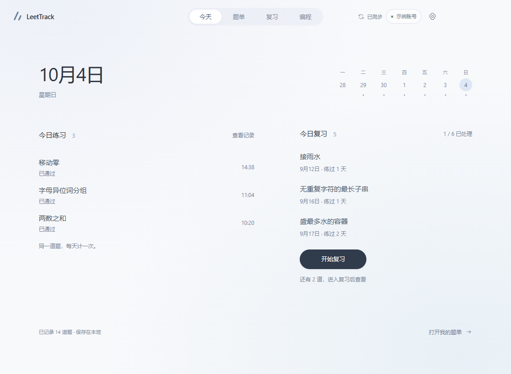
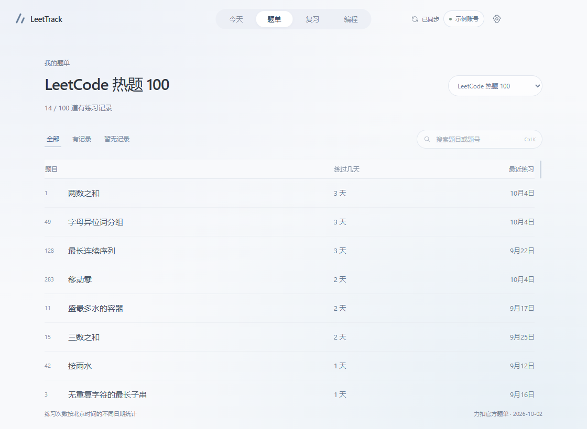
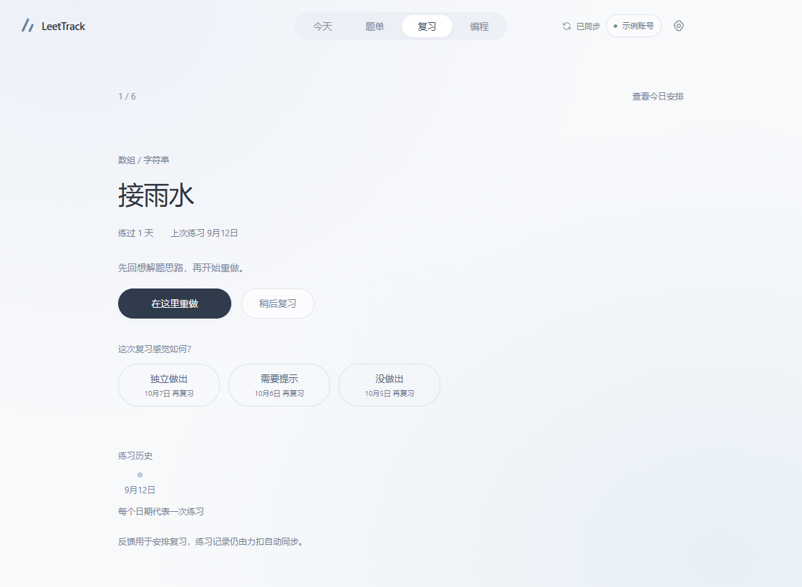
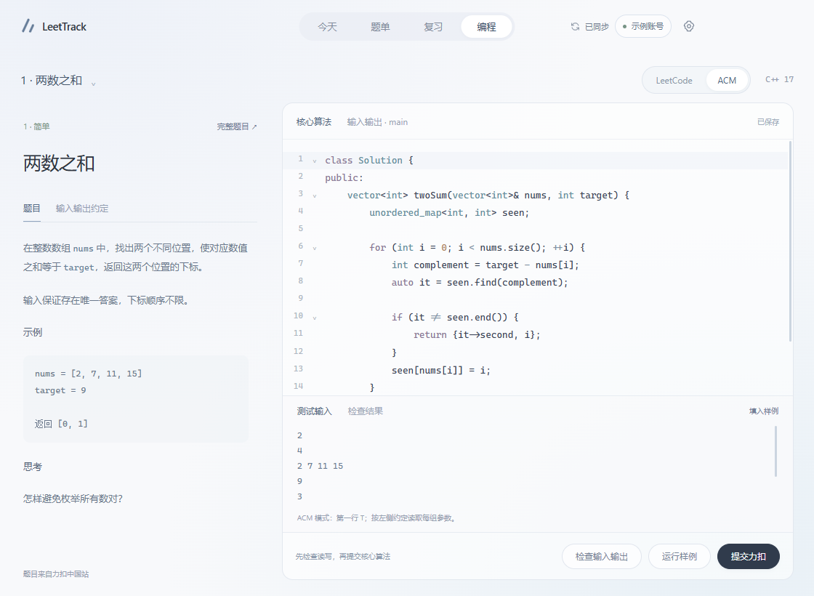

<div align="center">


# LeetTrack

自动记录每天做过的题，安排下一次复习。

力扣中国站的桌面练习记录器

**[下载 Windows 版](https://github.com/devinfenn/leettrack/releases/download/v0.1.1/LeetTrack-Setup-0.1.1-x64.exe)** &nbsp; · &nbsp; [使用指南](docs/guide.md) &nbsp; · &nbsp; [反馈问题](https://github.com/devinfenn/leettrack/issues)

<sub>Windows 10 / 11 · 64 位 · v0.1.1</sub>

</div>

<br>



<p align="center"><sub>实际应用界面 · 图中账号与练习记录均为示例数据</sub></p>

## 练习与复习

- **自动同步** — 连接力扣中国站账号，提交记录自动出现在软件里。同一道题在北京时间的同一天提交多次，只计一次练习。
- **题单进度** — 热题 100、面试经典 150，查看每题练过几天、最近何时练习。
- **每日复习** — 每天最多 6 道到期题，根据「独立做出 / 需要提示 / 没做出」调整下一次复习时间。
- **直接写代码** — C++ 17 编辑器。LeetCode 模式交给力扣评测；ACM 模式分开编写核心算法和 main，检查输入输出后提交核心算法。

练习记录、复习反馈和代码草稿保存在本机。支持补齐历史、切换账号和导出记录。

<details>
<summary>查看题单、复习和编程界面</summary>

### 题单

每题的练习天数和最近练习日期，一眼可见。



### 复习

一次专注一道题，回想、重做，再记录这次的掌握情况。



### 编程

核心算法与输入输出分开编写，草稿自动保存。



以上均为实际应用界面，使用示例数据；编程图展示编辑状态，未执行评测。

</details>

## 开始使用

1. [下载安装包](https://github.com/devinfenn/leettrack/releases/latest)，按中文向导完成安装。
2. 打开 LeetTrack，点击右上角 **连接账号**，在力扣中国站页面登录。
3. 正常刷题，回来查看记录与复习安排。

安装包包含桌面运行环境，无需安装 Node.js。ACM 本地检查与运行需另行[配置 g++](docs/guide.md#配置-acm-的-c-编译器)。当前安装包未签名，Windows 可能提示未识别发布者；[发行页](https://github.com/devinfenn/leettrack/releases/latest)提供 SHA-256 校验值。

## 本地开发

使用 Node.js 24：

```sh
npm ci
npm start
```

[开发与打包](docs/guide.md#开发与打包) · [验证记录](VERIFICATION.md) · [第三方许可证](THIRD_PARTY_NOTICES.md)
